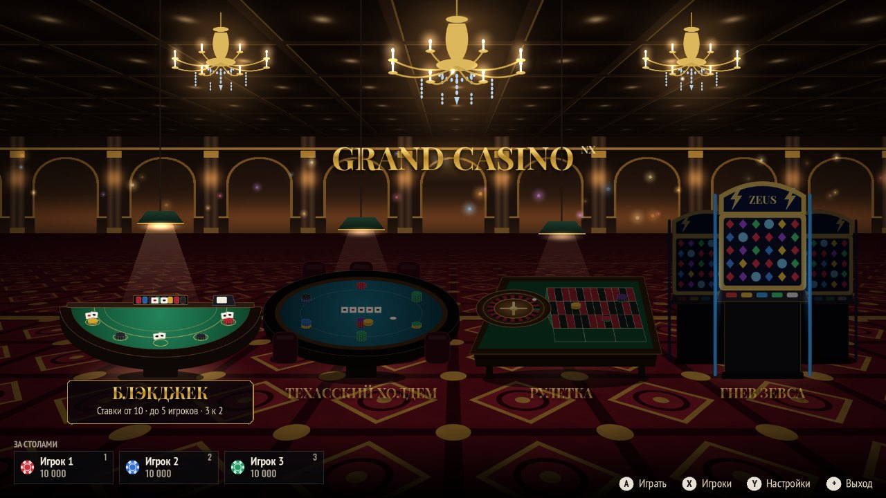
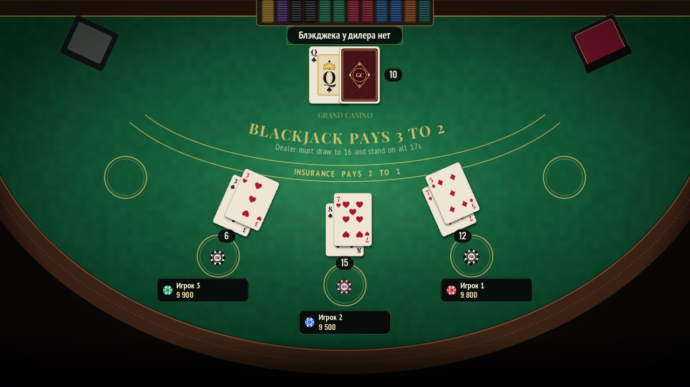
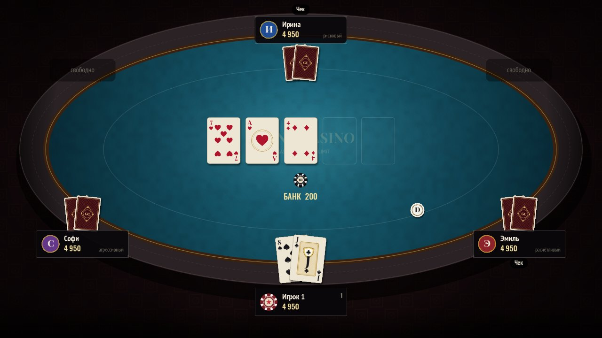
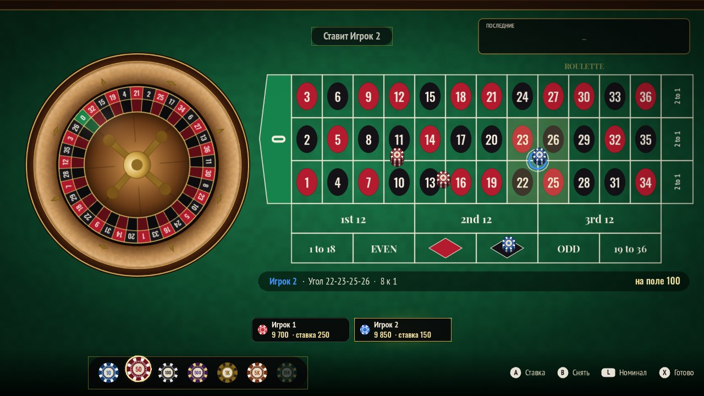
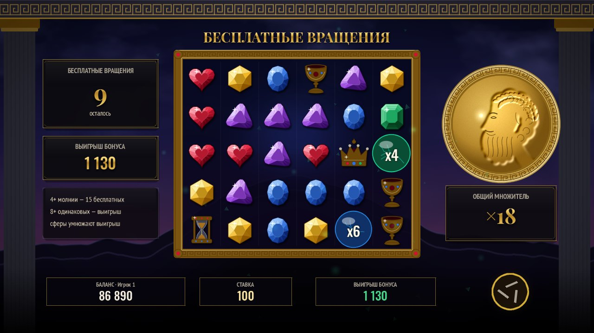

# Grand Casino NX

Казино для прошитой Nintendo Switch (Atmosphère / Ultra NX): блэкджек, техасский холдем, европейская
рулетка и слот «Гнев Зевса». В каждую игру можно играть компанией на одной консоли. Главное меню
сделано в виде игрового зала казино.

Ставки делаются только виртуальными фишками, реальные деньги в игре не участвуют.



| | |
|---|---|
|  |  |
|  |  |

## Установка

1. Скачайте [`dist/GrandCasinoNX.nro`](dist/GrandCasinoNX.nro). На GitHub откройте файл и нажмите
   «Download raw file».
2. Скопируйте его на карту памяти в папку `/switch/`, например `/switch/GrandCasinoNX/GrandCasinoNX.nro`.
3. Запустите Homebrew Menu. Лучше делать это через любую игру с зажатой кнопкой **R**: так
   приложению достаётся вся память и вся производительность. Через «Альбом» игра тоже запустится.
4. Выберите **Grand Casino NX**.

Прогресс (имена, фишки, настройки) хранится в `sdmc:/switch/GrandCasinoNX/save.cfg`.
Если закрыть игру прямо за покерным столом, фишки со стола вернутся на баланс при следующем запуске.

## Игра компанией

- В меню **Игроки** (кнопка X в зале) можно посадить за стол до шести человек, задать каждому имя
  (системная клавиатура) и цвет фишек.
- Игрок №1 играет контроллером с первой лампочкой, игрок №2 — со второй и так далее. Один Joy-Con,
  повёрнутый горизонтально, тоже считается полноценным контроллером. Кнопка R в меню «Игроки»
  открывает системный экран настройки Joy-Con.
- Если контроллер один, передавайте его друг другу: игра всегда показывает, чей сейчас ход.
- В покере карты по умолчанию скрыты, если за столом больше одного человека. Чтобы посмотреть свои
  карты, удерживайте **R**, пока остальные отворачиваются. Режим меняется в настройках: «Авто»,
  «Всегда» или «Никогда».
- Пустые места за покерным столом занимают боты, у каждого свой характер: осторожный, агрессивный,
  расчётливый или рисковый.
- Если фишки закончились, их можно пополнить в **Кассе** (кнопка − в меню «Игроки»): баланс
  восстанавливается до 10 000.

## Управление

| Где | Кнопки |
|---|---|
| **Зал** | ←/→ — выбор стола, A — сесть, X — игроки, Y — настройки, + — выход |
| **Блэкджек, ставки** | ←/→ или L/R — номинал фишки, A — поставить, B — убрать, Y — повторить прошлую ставку, X — готово (без ставки — пропустить раунд) |
| **Блэкджек, раунд** | A — ещё, B — хватит, X — удвоить, Y — сплит, R — сдаться; страховка: A — да, B — нет |
| **Покер** | A — чек/колл, B — фолд, X — рейз, Y — олл-ин, удерживать R — свои карты |
| **Покер, рейз** | ←/→ — ±большой блайнд, ↑/↓ — ±¼ банка, Y — всё, A — подтвердить, B — отмена |
| **Рулетка** | крестовина — поле (между номерами — сплиты и углы, под ними — стриты), A — фишка, B — снять, L/R — номинал, Y — снять все, − — повторить ставки, X — ставки сделаны |
| **Гнев Зевса** | A — вращать, ←/→ — ставка, Y — автоигра, X — турбо, ZR — купить бонус, − — следующий игрок |
| **Везде** | + — пауза, правила, выход из-за стола |

## Игры

**Блэкджек.** Шесть колод, дилер останавливается на любых 17, блэкджек платит 3 к 2. Можно удваивать,
делать сплит (до четырёх рук), сдаваться и брать страховку. За столом пять боксов: игроки делают
ставки по очереди, играют против дилера, а раздача идёт справа налево, как в настоящем казино.

**Техасский холдем.** No-Limit на 2–6 мест: блайнды, баттон, сайд-поты и честное деление банка.
Бай-ин и уровень блайндов выбираются в лобби стола. В конце раздачи подсвечивается выигрышная
комбинация, а её название пишется по-русски («Фулл-хаус: три дамы и два короля»).

**Европейская рулетка.** Колесо с одним зеро. Шарик катится по треку, теряет скорость, прыгает по
ячейкам и останавливается в одной из них. Доступны все ставки разметки: номер, сплит, стрит, угол,
сикслайн, трио, первые четыре, колонны, дюжины и равные шансы. У каждого игрока фишки своего цвета,
как на настоящем столе.

**Гнев Зевса.** Слот 6×5: платят 8 и более одинаковых символов в любом месте экрана, выигравшие
символы разбиваются, и сверху падают новые. Сферы-множители от ×2 до ×500 срабатывают по удару
молнии Зевса. За 4 молнии и больше даётся 15 бесплатных вращений, в которых множители копятся.
Бонус можно купить. Отдача около 96%, это проверено симуляцией на миллионах вращений
(`tools/slot_sim.cpp`).

Звуки (фишки, карты, шарик, гром) и обе музыкальные темы синтезируются в коде. Вся графика тоже
процедурная: карты, фишки, столы, зал и медальон Зевса. Внешних картинок и звуковых файлов в игре нет.

## Сборка из исходников

Для Switch нужен devkitPro (libnx и switch-sdl2). Проще всего собрать через Docker:

```sh
docker run --rm -v "$PWD":/src -w /src devkitpro/devkita64 make -j8
```

Получится файл `GrandCasinoNX.nro`. GitHub Actions собирает его при каждом пуше
(`.github/workflows/build.yml`).

Версия для ПК (Linux) нужна для разработки:

```sh
sudo apt install libsdl2-dev libsdl2-ttf-dev
make -f Makefile.pc -j8 && ./build-pc/grandcasino
make -f Makefile.pc tests     # проверки правил
make -f Makefile.pc slotsim   # статистика слота
```

На ПК управление с клавиатуры: стрелки, Enter = A, Backspace = B, X, C = Y, Q/E = L/R, 1/3 = ZL/ZR,
Esc = +, Tab = −. Геймпады тоже поддерживаются.

## Используемые проекты

- [SDL2 и SDL2_ttf](https://libsdl.org) (zlib), [libnx](https://github.com/switchbrew/libnx) (ISC)
- [nanosvg](https://github.com/memononen/nanosvg) (zlib)
- Шрифты Playfair Display, PT Sans Narrow и Oswald (SIL Open Font License)

Тексты лицензий лежат в папке [`licenses/`](licenses).
